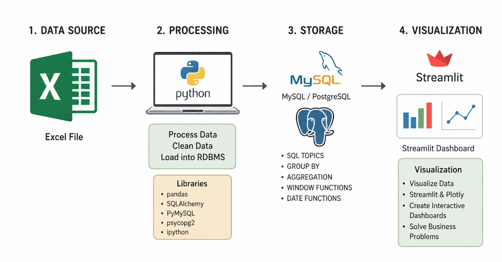

# Walmart Sales Analysis: PostgreSQL and Streamlit BI Portal

This project provides an end-to-end data engineering and business intelligence solution for analyzing Walmart transactional sales data. It includes data cleaning via Python (Pandas), schema setup and database loading on a local PostgreSQL database server, execution of 9 core business problem SQL statements, and a premium dark-themed Streamlit Business Intelligence dashboard.

## Data Pipeline Diagram



The flowchart above outlines the four stages of the project:
1. **Data Source**: Loading the transactional sales records from the raw CSV dataset.
2. **Processing**: Running a Python pipeline powered by Pandas and SQLAlchemy to eliminate duplicates, handle missing values, clean prices, and engineer calculated fields.
3. **Storage**: Ingesting the structured, normalized tables into a local PostgreSQL database server to execute advanced database operations (window functions, rankings, datetime functions, and aggregations).
4. **Visualization**: Creating a web-based, interactive dark-themed analytical dashboard using Streamlit and Plotly to solve corporate business problems.

---

## Project Structure

* **dashboard.py**: Interactive, dark-themed Streamlit BI dashboard connected live to PostgreSQL, visualizing metrics for the 9 business problems.
* **run_postgres.py**: Automation script that cleans the raw dataset, populates the PostgreSQL database table, runs the SQL queries, and generates a structured analysis report.
* **PSQL Queries.sql**: Source database file containing the raw PostgreSQL statements for the 9 business questions.
* **walmart_clean_data.csv**: Processed and normalized transactional dataset ready for analytical loading.
* **walmart_pipeline.png**: Flowchart diagram illustrating the end-to-end data engineering and visualization architecture.
* **requirements.txt**: List of Python dependency packages required to execute the portal.

---

## Dataset Schema

The cleaned dataset consists of 9,969 transaction records across the following columns:

* **invoice_id**: Unique transaction identifier.
* **branch**: Retail branch code.
* **city**: City where the branch is located.
* **category**: Product category department.
* **unit_price**: Price per single item.
* **quantity**: Number of items purchased.
* **date**: Date of transaction (DD/MM/YY format).
* **time**: Time of transaction (HH:MM:S format).
* **payment_method**: Cash, Credit card, or Ewallet.
* **rating**: Customer satisfaction rating (1 to 10 scale).
* **profit_margin**: Product markup margin percentage.
* **total**: Calculated gross sales volume (unit_price * quantity).
* **profit**: Calculated net profit margin (total * profit_margin).

---

## Data Cleaning and Normalization Steps

The raw transactional data underwent the following pre-processing stages:
1. **Duplicate Elimination**: Duplicate records were dropped to ensure data uniqueness.
2. **Missing Value Removal**: Rows containing null or blank fields were stripped.
3. **Format Standardization**: Stripped currency symbols ($) from prices and cast values to numeric float datatypes.
4. **Calculated Fields**: Engineered columns for gross revenue (total) and net profit (profit) at row-level.
5. **Schema Concurrency**: Cast all column headers to lowercase to ensure compatibility with PostgreSQL tables.

---

## The 9 Business Problems and SQL Solutions

The repository tracks and solves 9 key business problems:

### 1. Payment Method Analysis
Find payment methods, the count of transactions, and the total quantity of items sold.
```sql
SELECT 
     payment_method,
     COUNT(*) as no_payments,
     SUM(quantity) as no_qty_sold
FROM walmart
GROUP BY payment_method;
```

### 2. Highest-Rated Product Category per Branch
Identify the highest-rated product category inside each branch.
```sql
SELECT branch, category, ROUND(avg_rating::numeric, 2) AS avg_rating
FROM (
    SELECT 
        branch,
        category,
        AVG(rating) as avg_rating,
        RANK() OVER(PARTITION BY branch ORDER BY AVG(rating) DESC) as rank
    FROM walmart
    GROUP BY 1, 2
) AS subquery
WHERE rank = 1;
```

### 3. Busiest Day of the Week per Branch
Identify the day of the week with the highest transaction volume for each branch.
```sql
SELECT branch, day_name, no_transactions
FROM (
    SELECT 
        branch,
        TO_CHAR(TO_DATE(date, 'DD/MM/YY'), 'Day') as day_name,
        COUNT(*) as no_transactions,
        RANK() OVER(PARTITION BY branch ORDER BY COUNT(*) DESC) as rank
    FROM walmart
    GROUP BY 1, 2
) AS subquery
WHERE rank = 1;
```

### 4. Total Quantity Sold per Payment Method
Calculate the aggregate quantities sold per payment channel.
```sql
SELECT 
     payment_method,
     SUM(quantity) as no_qty_sold
FROM walmart
GROUP BY payment_method;
```

### 5. Category Rating Statistics per City
Determine the average, minimum, and maximum customer ratings of product categories in each city.
```sql
SELECT 
    city,
    category,
    MIN(rating) as min_rating,
    MAX(rating) as max_rating,
    ROUND(AVG(rating)::numeric, 2) as avg_rating
FROM walmart
GROUP BY 1, 2;
```

### 6. Total Profit per Category
Calculate the total profit for each product category, sorted from highest to lowest.
```sql
SELECT 
    category,
    ROUND(SUM(total)::numeric, 2) as total_revenue,
    ROUND(SUM(total * profit_margin)::numeric, 2) as profit
FROM walmart
GROUP BY 1
ORDER BY profit DESC;
```

### 7. Most Common Payment Method per Branch
Find the most widely used payment method in each branch.
```sql
WITH cte AS (
    SELECT 
        branch,
        payment_method,
        COUNT(*) as total_trans,
        RANK() OVER(PARTITION BY branch ORDER BY COUNT(*) DESC) as rank
    FROM walmart
    GROUP BY 1, 2
)
SELECT branch, payment_method AS preferred_payment_method
FROM cte
WHERE rank = 1;
```

### 8. Transactions by Hourly Shifts
Categorize transactions into Morning (before 12:00), Afternoon (12:00 to 17:00), and Evening (after 17:00) shifts, and calculate invoice counts per branch and shift.
```sql
SELECT
    branch,
    CASE 
        WHEN EXTRACT(HOUR FROM(time::time)) < 12 THEN 'Morning'
        WHEN EXTRACT(HOUR FROM(time::time)) BETWEEN 12 AND 17 THEN 'Afternoon'
        ELSE 'Evening'
    END day_time,
    COUNT(*) AS num_invoices
FROM walmart
GROUP BY 1, 2
ORDER BY 1, 3 DESC;
```

### 9. Top 5 Branches with Highest Revenue Decline Ratio (2022 vs 2023)
Compare yearly revenues to find the 5 branches with the largest revenue decrease ratios comparing 2023 to 2022.
```sql
WITH revenue_2022 AS (
    SELECT branch, SUM(total) as revenue
    FROM walmart
    WHERE EXTRACT(YEAR FROM TO_DATE(date, 'DD/MM/YY')) = 2022
    GROUP BY 1
),
revenue_2023 AS (
    SELECT branch, SUM(total) as revenue
    FROM walmart
    WHERE EXTRACT(YEAR FROM TO_DATE(date, 'DD/MM/YY')) = 2023
    GROUP BY 1
)
SELECT 
    ls.branch,
    ROUND(ls.revenue::numeric, 2) as last_year_revenue,
    ROUND(cs.revenue::numeric, 2) as cr_year_revenue,
    ROUND((ls.revenue - cs.revenue)::numeric / ls.revenue::numeric * 100, 2) as rev_dec_ratio
FROM revenue_2022 as ls
JOIN revenue_2023 as cs ON ls.branch = cs.branch
WHERE ls.revenue > cs.revenue
ORDER BY 4 DESC
LIMIT 5;
```

---

## Installation and Execution Setup

Follow these steps to run the analysis pipeline and launch the Streamlit dashboard on your system:

### 1. Prerequisite Installations
Ensure Python 3.8+ and a local PostgreSQL database server are installed and running.

### 2. Clone the Repository
Clone the repository to your local drive:
```bash
git clone https://github.com/kapish19/Walmart_Sales_Analysis.git
cd Walmart_Sales_Analysis
```

### 3. Install Python Dependencies
Install the required packages using pip:
```bash
pip install -r requirements.txt
```

### 4. Setup and Populate PostgreSQL
Make sure your PostgreSQL server is active. Update the database URL parameters in the scripts if your host, user, or password differ from default configurations:
* Default Database User: `postgres`
* Default Password: `x0000`
* Default Database Name: `walmart_db`

Run the python compiler pipeline to clean the raw data, establish tables, and execute query logs:
```bash
python run_postgres.py
```

### 5. Launch the Streamlit Dashboard
Start the Streamlit analytical dashboard server:
```bash
streamlit run dashboard.py
```
Open the local URL generated by the terminal in your browser (typically `http://localhost:8501`) to interact with the visualizations, apply slicers, and use the live SQL sandbox.
